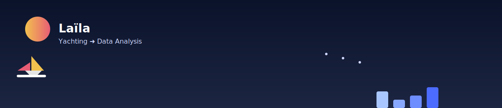
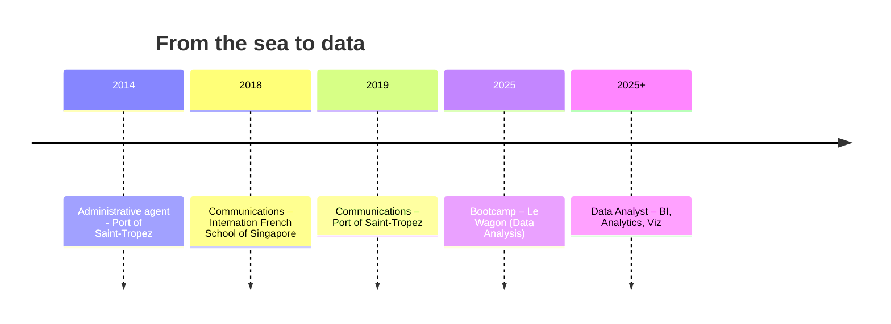

<h1 align="center">Hi, I'm Laïla 👋</h1>

Former <b>Communication Manager at the Port of Saint‑Tropez</b> ⛵ → fresh graduate of <b>Le Wagon's Data Analysis bootcamp</b> 📊. 
I turn <i>waves</i> into <i>datasets</i> and love telling stories with data.

  

---

## 🧭 About

* 🎓 Bootcamp: **Le Wagon – Data Analysis** (year: 2025).
* 🛥️ Before: **Communications Manager** at the **Port of Saint‑Tropez** (yachting & luxury).
* ✈️ Currently working on: **Insights for Airlines — Evolution of Air Fares & Traffic in France since COVID** (pricing & demand trends, seasonality, recovery patterns, dashboards).
* 📍 Based in **France** (open to remote/hybrid).
* 💬 Languages: **FR/EN/IT**.
* 🎯 Looking for: **Marketing/Business analyst role** / **first data role** (BI / analytics / data viz).

---
## 🛠️ Stack & Tools

**Languages**
`Python` (pandas, numpy, matplotlib, BeautifulSoup), `SQL` ( Google BigQuery)

**BI & Viz**
`Looker Studio`,`Power BI`

**Data**
`BigQuery`, `dbt` (basics), `Fivetran` (notions), `Spreadsheets` (Google Sheet, Excel)

**Other**
`Git/GitHub`, `Notion`, `GA4`, 

---

## 🎭 My journey in 3 acts

* **Act I – Yachting & Luxury**: brand image and storytelling, press, social media, event ops and marketing.
* **Act II – Bootcamp**: statistics, SQL, Python, data viz, dashboarding, A/B testing and machine learning.
* **Act III – Data Analyst**: curious, impact‑driven, with a **premium craft** for analytics.

## 🤝 What I bring

* **Crystal‑clear communication** (ex‑comms) → pedagogy & data storytelling.
* **Premium service mindset** (yachting) → attention to detail, high standards.
* **Data‑driven** → business questions, useful KPIs, quick iterations.

---

## 💡 Projects

* **[Project 1 – STREAMING SMARTER ]([https://lookerstudio.google.com/reporting/494d411b-2cd2-48cb-8a12-1781b26d1f0d])**
  *BigQuery + Looker Studio.*
The analysis compare catalogs from Netflix, Disney+, Hulu, and Prime Video by ingesting, standardizing, and unifying platform data, then enriching gaps with an API. The analysis tracks trends over time, genre popularity, and content strategy (format mix, audience, geography, recency). The goal is to surface actionable insights and forward-looking signals to guide content acquisition and regional expansion. Key metrics include library growth, genre diversity, audience mix, country distribution and release recency.
