# README.md (to paste in `Lousd1/Lousd1`)

> Replace the 🎯 sections and links/handles. Keep this file at the repo root.

---


<h1 align="center">Hi, I'm Laïla 👋</h1>

<p align="center">
Former <b>Communication Manager at the Port of Saint‑Tropez</b> ⛵ → fresh graduate of <b>Le Wagon's Data Analysis bootcamp</b> 📊.<br/>
I turn <i>waves</i> into <i>datasets</i> and love telling stories with data.
</p>

<p align="center">
  <a href="https://www.linkedin.com/in/YOUR_HANDLE/">
    
  </a>
  <a href="mailto:YOUR_EMAIL">
    
  </a>
  <a href="#-projects">
    
  </a>
</p>

---

## 🧭 About

* 🎓 Bootcamp: **Le Wagon – Data Analysis** (year: 2025).
* 🛥️ Before: **Communications Manager** at the **Port of Saint‑Tropez** (yachting & luxury).
* ✈️ Currently working on: **Insights for Airlines — Evolution of Air Fares & Traffic in France since COVID** (pricing & demand trends, seasonality, recovery patterns, dashboards).
* 📍 Based in **France** (open to remote/hybrid).
* 💬 Languages: **FR/EN/IT**.
* 🎯 Looking for: **Marketing/Business analyst role** / **first data role** (BI / analytics / data viz).

```mermaid
timeline
  title From the sea to data
  2014 : Administrative agent - Port of Saint-Tropez
  2018 : Communications – Internation French School of Singapore
  2019 : Communications – Port of Saint‑Tropez
  2025 : Bootcamp – Le Wagon (Data Analysis)
  2025+ : Data Analyst – BI, Analytics, Viz
```




---

## 🛠️ Stack & Tools

**Languages**
`Python` (pandas, numpy, matplotlib, BeautifulSoup), `SQL` ( Google BigQuery)

**BI & Viz**
`Looker Studio`,`Power BI`

**Data**
`BigQuery`, `dbt` (basics), `Fivetran` (notions), `Spreadsheets` (Google Sheet, Excel)

**Other**
`Git/GitHub`, `Notion`, `GA4`, 

---

## 🚤→📈 My journey in 3 acts

* **Act I – Yachting & Luxury**: brand image and storytelling, press, social media, event ops and marketing.
* **Act II – Bootcamp**: statistics, SQL, Python, data viz, dashboarding, A/B testing and machine learning.
* **Act III – Data Analyst**: curious, impact‑driven, with a **premium craft** for analytics.

---

## 💡 Projects

* **[Project 1 – STREAMING SMARTER ]([https://lookerstudio.google.com/reporting/494d411b-2cd2-48cb-8a12-1781b26d1f0d])**
  *BigQuery + Looker Studio.*
The analysis compare catalogs from Netflix, Disney+, Hulu, and Prime Video by ingesting, standardizing, and unifying platform data, then enriching gaps with an API. The analysis tracks trends over time, genre popularity, and content strategy (format mix, audience, geography, recency). The goal is to surface actionable insights and forward-looking signals to guide content acquisition and regional expansion. Key metrics include library growth, genre diversity, audience mix, country distribution and release recency.


## 🤝 What I bring

* **Crystal‑clear communication** (ex‑comms) → pedagogy & data storytelling.
* **Premium service mindset** (yachting) → attention to detail, high standards.
* **Data‑driven** → business questions, useful KPIs, quick iterations.

---

## 📬 Contact

**LinkedIn**: [Laïla Soldà] (https://www.linkedin.com/in/laila-solda/)

---

<sub>Palette inspired by the Côte d’Azur: `#0A66C2` azure, `#0B132B` navy, `#F2C14E` gold, `#E85D75` coral.</sub>

---

# assets/banner.svg (create `assets/` in the repo and paste this SVG)

```svg
<svg width="1200" height="260" viewBox="0 0 1200 260" xmlns="http://www.w3.org/2000/svg" role="img" aria-label="From Yachting to Data">
  <defs>
    <linearGradient id="sea" x1="0" x2="0" y1="0" y2="1">
      <stop offset="0%" stop-color="#0B132B"/>
      <stop offset="100%" stop-color="#1C2541"/>
    </linearGradient>
    <linearGradient id="sun" x1="0" x2="1" y1="0" y2="0">
      <stop offset="0%" stop-color="#F2C14E"/>
      <stop offset="100%" stop-color="#E85D75"/>
    </linearGradient>
    <style>
      .title{ font: 700 28px system-ui, -apple-system, Segoe UI, Roboto, Helvetica, Arial; fill:#fff }
      .subtitle{ font: 400 16px system-ui, -apple-system, Segoe UI, Roboto, Helvetica, Arial; fill:#cfd8ff }
      .dot{ animation: blink 1.2s infinite alternate }
      @keyframes blink{ from{opacity:.3} to{opacity:1} }
      #boat{ animation: sail 8s linear infinite }
      @keyframes sail{ 0%{ transform: translateX(-50px) translateY(0) } 50%{ transform: translateX(550px) translateY(-6px) } 100%{ transform: translateX(1150px) translateY(0) } }
      #bars rect{ animation: grow 2.5s ease-in-out infinite alternate }
      @keyframes grow{ from{ height:10px; y:180 } to{ height:80px; y:110 } }
    </style>
  </defs>
  <rect width="1200" height="260" fill="url(#sea)"/>

  <!-- Sun / luxury vibe on the left -->
  <circle cx="90" cy="70" r="30" fill="url(#sun)"/>
  <text x="140" y="78" class="title">Louise</text>
  <text x="140" y="105" class="subtitle">Yachting ➜ Data Analysis</text>

  <!-- Boat sailing to the right -->
  <g id="boat" transform="translate(0,0)">
    <path d="M0 0" fill="none" stroke="none"/>
    <g transform="translate(60,170)">
      <path d="M0 0 L40 0 L30 10 L10 10 Z" fill="#E5E5E5"/>
      <polygon points="15,-35 15,0 45,0" fill="#F2C14E"/>
      <polygon points="12,-20 12,0 -18,0" fill="#E85D75"/>
      <rect x="-20" y="10" width="70" height="6" rx="3" fill="#ffffff55"/>
    </g>
  </g>

  <!-- Animated bar chart (data world) on the right -->
  <g id="bars" transform="translate(900,80)">
    <rect x="0" y="140" width="28" height="40" rx="4" fill="#A9C6FF" style="animation-delay:0s"/>
    <rect x="40" y="160" width="28" height="20" rx="4" fill="#88A8FF" style="animation-delay:.2s"/>
    <rect x="80" y="150" width="28" height="30" rx="4" fill="#6E8DFF" style="animation-delay:.4s"/>
    <rect x="120" y="130" width="28" height="50" rx="4" fill="#4C6BFF" style="animation-delay:.6s"/>
  </g>

  <!-- Dots for the transition -->
  <circle class="dot" cx="780" cy="130" r="3" fill="#cfd8ff"/>
  <circle class="dot" cx="820" cy="140" r="3" fill="#cfd8ff"/>
  <circle class="dot" cx="860" cy="150" r="3" fill="#cfd8ff"/>
</svg>
```


